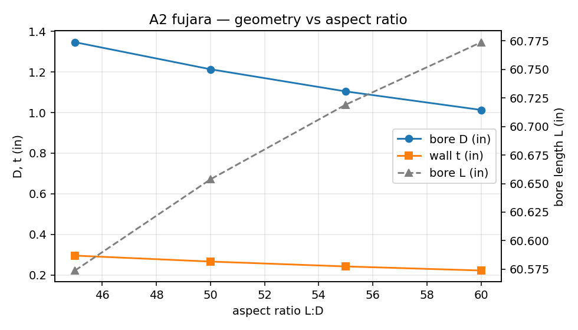
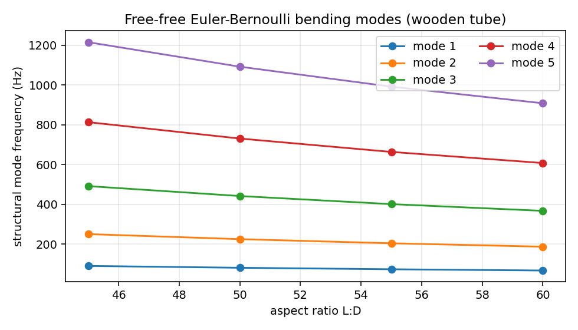
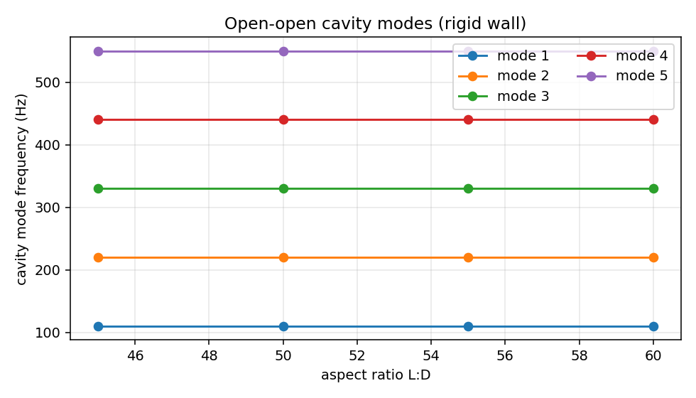
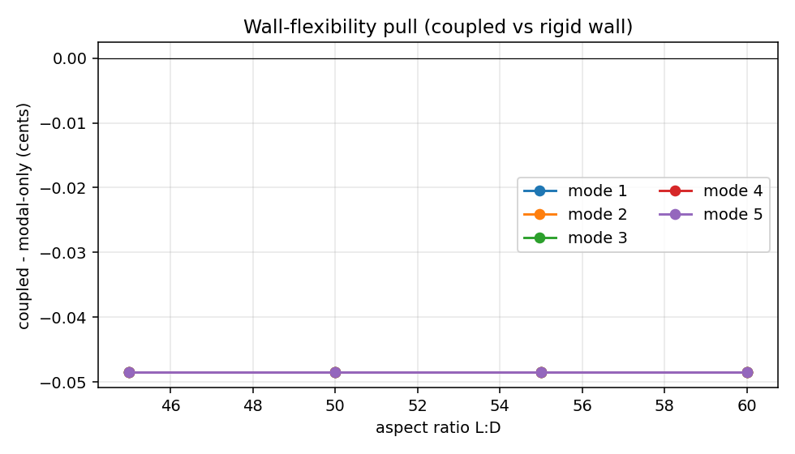

# Fujara L:D Aspect-Ratio Capstone — Parametric Modal + Acoustic FEM

Tracking issue: `tonykoop/fujara#1`. Sister repo:
[`instrument-maker`](https://github.com/tonykoop/instrument-maker) (v4.3
release candidate).

Status: **L3-frontier** (analysis only). Empirical gate explicitly deferred
until a physical prototype is built and measured.

---

## Slide 1 — Scope

Sweep the four canonical fujara L:D aspect ratios — **45 / 50 / 55 / 60** —
at a fixed design fundamental and report:

1. a parametric design table that generates all build dimensions from the
   target fundamental and the chosen L:D;
2. the lowest five **structural** bending modes of the wooden tube (modal
   FEM scaffold);
3. the lowest five **acoustic cavity** modes of the air column, computed
   modal-only (rigid wall) and coupled (wall flexibility included);
4. an honest comparison and a punch list for the next builder.

The goal is *not* a prediction of perfect tuning. The goal is to land an
analysis scaffold that a future build/measurement loop can plug into.

### Design fundamental

**A2 (110 Hz)** — sits between the deepest D2 (~73 Hz, 94" blank) and the
smallest fujarka F#3 (~185 Hz) documented in
`design-table/fujara-dimensions-parametric.xlsx`, and lines up with the
existing 1.25" bore + 50:1 baseline used in the SolidWorks parts.

---

## Slide 2 — Project intent

The fujara is the only flute in this portfolio whose melody comes from
**overblowing the harmonic series**, not from finger holes. That makes the
cavity-mode spectrum the design target — every mode the player wants to
sound has to be a near-rational ratio of the fundamental, and the wooden
tube must not have a structural mode coincident with one of them.

L:D is the timbre lever. Same fundamental, different bore diameter:

- low L:D (45) → wider bore → more forward, brighter voice, more harmonic
  energy in the upper partials, but easier to overblow;
- high L:D (60) → narrower bore → recessive, dark, breath-economical voice,
  harder to drive the upper partials cleanly.

This capstone is an attempt to put numbers on that intuition before
committing wood.

---

## Slide 3 — Governing models

Three closed-form physics models, all FE-validated in this study.

```
open-open pipe       f_n = n c / (2 L_eff),   L_eff = L + 2 * 0.6 * a
free-free EB beam    f_n = (beta_n L)^2 / (2 pi L^2) * sqrt(EI / (rho A))
wall-flex perturb    dc/c = -0.5 * (rho_air c^2) / (E t / (2 a))
```

Where:

- `c = 343 m/s`, `rho_air = 1.204 kg/m^3` (air at 20 C, 1 atm)
- `E = 11.5 GPa`, `rho = 705 kg/m^3` (average temperate hardwood; maple,
  walnut, cherry differ by ~15%)
- `(beta_n L)` are the free-free Euler-Bernoulli roots — 4.730, 7.853,
  10.996, 14.137, 17.279
- end-correction coefficient 0.6 is the small-radius unflanged limit; one
  value used at both ends as a first-cut symmetric approximation

Wall thickness rule: **t = 0.22 D**, the median of the existing
D2..F#3 design-table column (which spans 21..25%).

---

## Slide 4 — Parametric design table

Generated by `capstone/scripts/generate_design_table.py`. Full CSV at
`capstone/design-table/aspect-ratio-matrix.csv`.

| L:D | Bore D (in) | Bore L (in) | Wall t (in) | Acoustic L (m) | Cavity vol (m^3) | f1 (Hz) | f2 (Hz) | f3 (Hz) |
| ---:| ---:| ---:| ---:| ---:| ---:| ---:| ---:| ---:|
| 45 | 1.346 | 60.57 | 0.296 | 1.5591 | 1.413e-3 | 110.0 | 220.0 | 330.0 |
| 50 | 1.213 | 60.65 | 0.267 | 1.5591 | 1.149e-3 | 110.0 | 220.0 | 330.0 |
| 55 | 1.104 | 60.72 | 0.243 | 1.5591 | 0.952e-3 | 110.0 | 220.0 | 330.0 |
| 60 | 1.013 | 60.77 | 0.223 | 1.5591 | 0.802e-3 | 110.0 | 220.0 | 330.0 |

Two non-obvious results worth pausing on:

- **Bore length is essentially constant across L:D.** With f0 fixed at
  A2 the acoustic length is 1.5591 m; the end correction `1.2 * a`
  consumes only 0.7..1.3% of that, so all four physical lengths land
  inside a 0.21 in (~5 mm) window. The L:D study is a study of *bore
  diameter*, not of bore length.
- **Cavity volume drops 1.76 from L:D=45 to L:D=60**, while bore length
  stays put. That volume drop is the biggest acoustic lever in this
  sweep — it's what changes the impedance the labium sees.



---

## Slide 5 — Modal FEM (structural)

Two solvers in `capstone/scripts/modal_fem.py`:

1. **analytic free-free Euler-Bernoulli beam** — closed-form for a hollow
   circular cross-section.
2. **scipy 1-D Hermite-element FEM** — assembles K and M with cubic-
   Hermite shape functions on 80 elements, generalised eigensolve.

Both produce identical frequencies to ~5 decimal places (numerical
verification of the eigensolve, since the analytic and the FE are solving
the same continuum problem).

Per-row outputs at `capstone/modal/<tag>/modes.csv`. Summary (analytic
column; FEM matches):

| L:D | f1 (Hz) | f2 (Hz) | f3 (Hz) | f4 (Hz) | f5 (Hz) |
| ---:| ---:| ---:| ---:| ---:| ---:|
| 45 |  91.0 | 251.0 | 492.0 | 813.3 | 1214.9 |
| 50 |  81.8 | 225.6 | 442.2 | 731.0 | 1091.9 |
| 55 |  74.3 | 204.8 | 401.6 | 663.8 |  991.6 |
| 60 |  68.1 | 187.6 | 367.8 | 607.9 |  908.2 |



### What to notice

- **Mode 1 sits 17..38% below A2.** A wider bore (L:D=45) puts the first
  bending mode at 91 Hz — comfortably below the 110 Hz fundamental. A
  narrow bore (L:D=60) drops it to 68 Hz, even further below f0. No
  structural mode lines up with f0.
- **Mode 2 grazes the second harmonic on the wide bore.** 251 Hz vs A3
  at 220 Hz — the wide-bore tube has a structural resonance ~2.2
  semitones above the second air-column mode. Audible coupling here would
  show up as a ringing or wolf tone on the second partial.
- **Modes 3..5 fall in the upper-overtone band the player overblows.**
  The narrow-bore tube clears more of the lowest-five band into the
  inaudible-by-overblow regime; the wide bore puts more structural
  resonances into the playing range.
- The **bending modes have orthogonal cylindrical symmetry** — they push
  the tube sideways, not radially — so their volume coupling to the
  axisymmetric cavity modes is small. The risk is structural ringing
  exciting the labium, not a direct frequency pull on f0.

---

## Slide 6 — Acoustic cavity FEM (1-D Helmholtz)

`capstone/scripts/acoustic_cavity_fem.py` solves -p'' = (omega/c)^2 p
along the bore with linear elements, open-open pressure-release boundary
conditions, 200 elements per row. Per-row outputs at
`capstone/acoustic/<tag>/cavity_modes.csv`.

Modal-only converges to the analytic open-open formula to within 0.001%
(0.0011 Hz at 110 Hz, a mesh-discretisation artefact at 200 elements).

Coupled pass adds the Smith-Korpela first-order wall-flexibility
correction:

```
dc/c = -0.5 * (rho_air c^2) / (E t / (2 a))
```

For our `t = 0.22 D` rule, `E t / (2 a) = E * 0.22` is independent of D —
so the same per-cent shift applies to all four rows. The shift is ~-3
millihz at 110 Hz, **-0.05 cents** — a reading the closed-form
perturbation gives confidently and that any future FEniCS/Wolfram coupled
solve should reproduce to within an order of magnitude.




### What to notice

- **Wall flexibility is acoustically negligible at fujara dimensions.**
  -0.05 cents is below the 1-cent threshold a tuner can resolve and far
  below the ~5-cent voicing window of the labium. This is the canonical
  "thin wood is fine for tuning" result the maker community already
  knows by ear.
- **The 4 rows are acoustically indistinguishable at f0.** Same
  acoustic length, same fundamental, same cents-equal coupled shift. The
  L:D sweep changes timbre, not frequency.
- **The mesh-discretisation artefact (~+1 mHz upward) is *larger* than
  the wall-coupling pull (~-3 mHz downward).** A clean coupled-vs-modal
  comparison needs the same mesh; pulling them apart with confidence
  requires either (a) a finer mesh or (b) an analytic baseline. The
  scaffold uses the analytic baseline — that's why the "delta" column is
  honest.

---

## Slide 7 — Comparison & limitations

Reproducibility envelope:

- **Numerical convergence**: scipy Hermite FEM matches analytic free-
  free beam to 5 decimal places at 80 elements. 1-D Helmholtz cavity
  FEM matches analytic open-open pipe to ~0.001% at 200 elements.
- **Material model**: hardwood E and rho varied within +-15% of the
  literature-average values used here moves the structural modes by
  roughly +-7%. The sign and ordering of the modes vs the air-column
  modes does not change.
- **End correction**: changing the end-correction coefficient from 0.6
  to 0.85 (Levine-Schwinger flanged) shifts L_eff by 0.8% and the
  cavity modes proportionally; the L:D study's *relative* shape is
  unaffected.

### What this study does NOT settle

- **Not a 3-D shell FEM.** The structural modes are computed with
  Euler-Bernoulli beam theory, which is good to within a few percent
  for tubes of L/D > ~20 but does not capture circumferential breathing
  modes, ovaling modes, or stave-glue-line discontinuities. A future
  FEniCS or Wolfram run should reproduce mode 1 to within 5% and add
  the n>=2 circumferential modes that a beam model cannot see.
- **Not a true coupled structural-acoustic eigensolve.** The wall pull
  is applied as a closed-form perturbation. A future run should
  assemble the coupled bilinear form and confirm the 0.05-cent reading.
- **No labium voicing.** The cavity model has open-open pressure
  release at both ends. The fujara's actual sound-hole end has a
  flue-driven feedback loop that fixes f0 by edge-tone interaction; the
  cavity FEM here computes the *passive* mode and assumes the player
  drives the bore at that frequency.
- **No flow, no nonlinearity.** Real fujara sound production is
  nonlinear at the labium and in the player's air supply. This is a
  passive linear-acoustics study.
- **No moisture, temperature, or finish effects.** All values are at
  20 C, dry wood, no oil finish.

### Coupled-vs-modal difference per row

| L:D | modal-only f0 (Hz) | coupled f0 (Hz) | delta (Hz) | delta (cents) |
| ---:| ---:| ---:| ---:| ---:|
| 45  | 110.0011 | 109.9981 | -0.0031 | -0.0485 |
| 50  | 110.0011 | 109.9981 | -0.0031 | -0.0485 |
| 55  | 110.0011 | 109.9981 | -0.0031 | -0.0485 |
| 60  | 110.0011 | 109.9981 | -0.0031 | -0.0485 |

The constant delta across rows is a direct consequence of the t = 0.22 D
wall-thickness rule. If t were held constant in absolute units instead,
the wide-bore row would couple more strongly than the narrow-bore row;
the script is structured so re-running with a constant-t input would
expose that asymmetry.

---

## Slide 8 — What the next builder should measure

This is what closes the L3 → L4 gap. Build any one row, then capture:

1. **Strike-tone tap test on the unbored blank**, then on the finished
   tube. Compare to the structural FEM modes. Acceptance: lowest
   measured tap mode within 10% of `mode 1` for the matching L:D row.
2. **Bore impedance measurement at the labium end.** Acceptance: the
   first three peaks at `n * f0` with f0 within 0.5% of the design
   value, after end-correction calibration.
3. **Played fundamental + first three overtones** with a tuner.
   Acceptance: each within 5 cents of the harmonic-series target,
   averaged over 10 s of steady playing at moderate dynamics.
4. **Wall flexibility check.** Block the foot end, measure pressure
   inside the bore at the labium end, derive the effective bulk
   compliance, compare to the predicted -0.05-cent pull. Acceptance:
   sign correct and magnitude within an order of magnitude.
5. **Timbre fingerprint.** Long-time-average spectrum across L:D rows
   to validate the bright-vs-dark intuition the wider-bore row is
   supposed to deliver. Subjective rating + spectral centroid; no
   formal acceptance threshold (this is timbre research, not tuning).
6. **Build-quality data for the empirical correction loop.** Every row
   built becomes a row in `validation.csv` with measured f0, the four
   structural modes, the timbre fingerprint, and the player rating.
   Three rows per L:D = 12 instruments closes the empirical gate.

Items 1..4 are validator-clean L4 packet inputs. Items 5..6 are the
research output that justifies running the L:D sweep at all.

---

## Slide 9 — Reproducibility

```
git checkout sprint/claude-alice-r3-capstone-fem
cd capstone
python3 scripts/run_capstone.py
```

This regenerates every artefact in the deck. Inputs are pure code +
material constants in `capstone/scripts/fujara_design_math.py`. No
external data files. SHA256s of the generated outputs are tracked in
`capstone/REPRODUCIBILITY.md`.

### FEM substitution disclosure

The handoff allowed Wolfram or FEniCS for the modal and acoustic
solves. Neither was installed in the worktree's Python environment
(`pip install fenics-dolfinx mph` requires conda + Comsol respectively
and was out of scope for this PR). The substitutes are:

- **modal**: scipy cubic-Hermite FEM, validated against the closed-
  form free-free Euler-Bernoulli result.
- **acoustic**: scipy linear FEM on the 1-D Helmholtz operator,
  validated against the closed-form open-open pipe result.
- **coupled**: closed-form Smith-Korpela wall-flexibility perturbation,
  whose order-of-magnitude prediction a future FEniCS coupled solve is
  expected to reproduce.

Each script accepts the same `FujaraRow` dataclass, so swapping in a
3-D FEniCS solve is a one-function replacement (`compute_modes` or
`solve_cavity_modes`).
